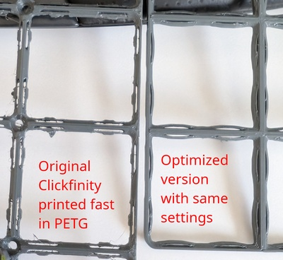
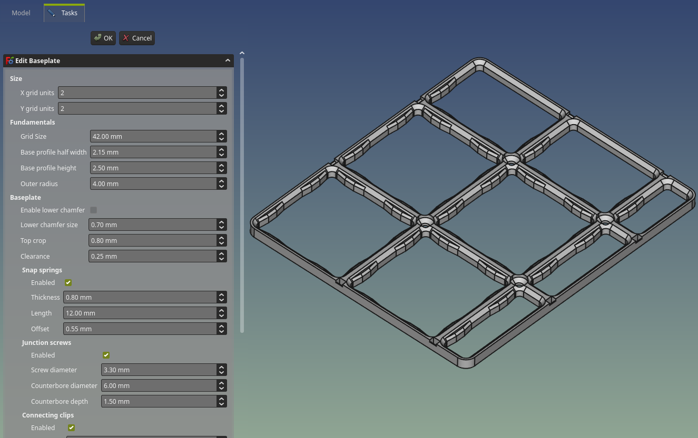
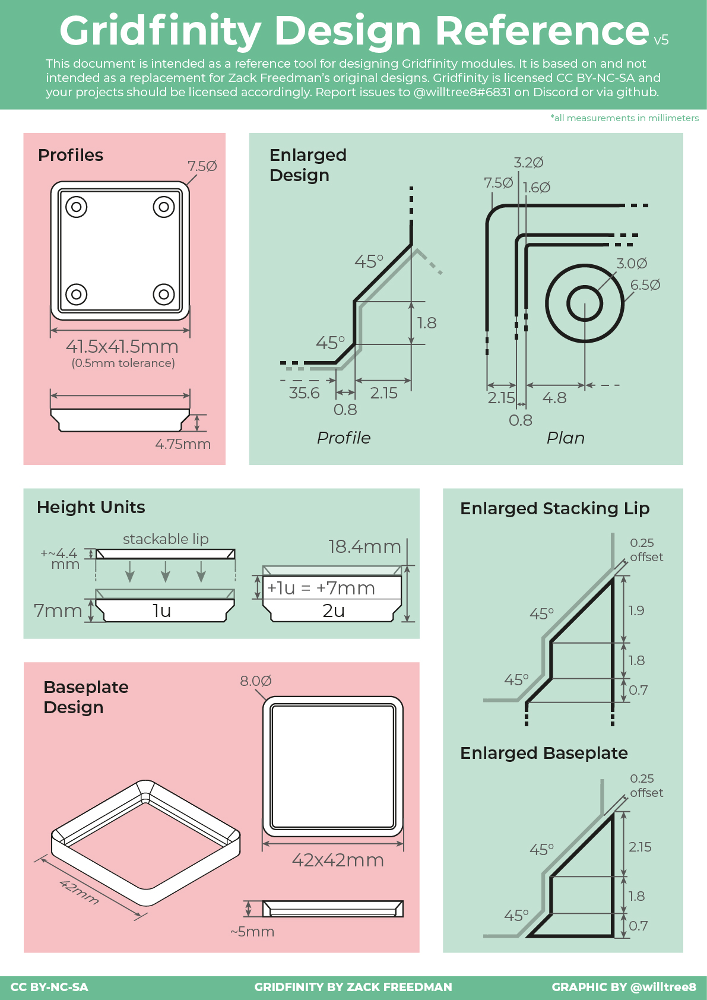

# Gridfinity-SP Workbench

Gridfinity-SP is a fork of the original [FreeCAD Gridfinity Workbench](https://github.com/Stu142/FreeCAD-Gridfinity-Workbench).

It adds an alternative Clickfinity-style baseplate workflow driven by base parameters.

This Clickfinity variant is tuned for simpler, more reliable 3D printing with fewer retracts.

[Pre-generated baseplates and supports](https://www.printables.com/model/1714411)

[Connecting clip install tool](https://www.printables.com/model/1714350)

Previously generated objects are not supported. Input parameters were heavily reworked to provide stable, compatible sizing.

The add-on may be renamed in the future to avoid clashing with the original Gridfinity add-on.

This is a work in progress, and breaking changes are likely.

## Features / New

* Default settings added
* Task dialog added for creating / editing "simple" baseplate
* Support generation added for baseplate stacking
* Custom sized fillers added for baseplates
* Working with FreeCAD 1.1 and FreeCAD Link

## TODO

* Incorporate magnets and screw holes into single design
* Rework bins
* Add custom sizes for bins

## Install

This fork uses the same workbench id/name as the official Gridfinity workbench.
Installing this fork will replace an existing official Gridfinity installation in your FreeCAD `Mod` folder.

### Option 1: Install with macro

1. Open [`install-gridfinity-sp.FCMacro`](install-gridfinity-sp.FCMacro) from this repository and copy its full contents.
2. In FreeCAD, go to `Macro -> Macros... -> Create`.
3. Enter a macro name, confirm, then paste the copied macro contents.
4. With the macro editor window open, run `Macro -> Execute macro`.
5. Check `Report view` for installer messages.
6. Restart FreeCAD.

The macro installs this fork into your user `Mod` directory as `Gridfinity`. If `Gridfinity` already exists, it is replaced and a timestamped backup is created automatically.

### Option 2: Manual install

1. Get this repository source:
   - Download and extract ZIP, or
   - Clone with git.
2. Copy the repository folder to your FreeCAD user `Mod` directory and name it `Gridfinity`.
3. Restart FreeCAD.

Typical FreeCAD user `Mod` paths:

- Windows: `%APPDATA%\\FreeCAD\\Mod`
- Linux: `~/.local/share/FreeCAD/Mod`
- macOS: `~/Library/Preferences/FreeCAD/Mod`

# Design principles

### Baseplate

* Main grid size is square, 42 mm
* It defines baseplate sizing
* Basic dimensions for baseplate profile are half width (2.15 mm) and height (2.5 mm) with 45° chamfer on top
* Lower chamfer for baseplate made optional with 0.7 mm size
* Outer fillet radius is taken from bin outer radius, 4 mm

### Bins

* Bins are defined from baseplates
* Clearance (0.25 mm) defines how much bins are in-set from four horizontal directions
* Otherwise bin profile completely duplicates baseplate profile

### Generic

* Fillets are mostly calculated from the Bin Outer Radius to keep walls thickness constant
* Some features, like clips, use proportional calculations to main profile sizes

### Reference design by @willtree8

Some of the dimensions are different from what is used in this implementation.

